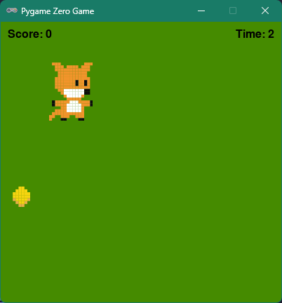

# Coin Collector Game

A simple 2D game built with Python and the [Pygame Zero](https://pygame-zero.readthedocs.io/en/stable/) library. The objective is to control a fox and collect as many coins as possible before the timer runs out.

This project is based on an example from the book *"Coding Games in Python"* by DK, with refactoring to improve structure, maintainability, and testability.


## Features

- **Player Control**: Move the fox using the `W`, `A`, `S`, and `D` keys.
- **Scoring**: Gain 10 points for every coin collected.
- **Countdown Timer**: The game lasts for 10 seconds.
- **Game Over**: A final score screen is displayed when time runs out.
- **Unit Tests**: The project includes a test suite using `pytest` to verify game logic.

## Requirements

- Python 3.x
- Pygame Zero
- Pytest (for running the tests)

## Installation

1.  **Clone or download the repository:**
    If you have Git, you can clone it. Otherwise, download the project files as a ZIP.

2.  **Navigate to the project directory:**
    ```bash
    cd path/to/CoinCollector
    ```

3.  **Install the required libraries:**
    ```bash
    pip install pgzero pytest
    ```

## Playing the Executable
For a simpler way to play without installing Python, you can download a pre-built executable from the project's **Releases** page on GitHub.

1.  Go to the repository's **Releases** tab.
2.  Download `coincollector.exe` (only tested on Windows).
3.  Run the downloaded file to play.

## How to Play
To run the game, execute the `coincollector.py` script using the `pgzrun` command in your terminal from the project's root directory:

```bash
pgzrun coincollector.py
```

## How to Run Tests

To ensure the game logic is working correctly, you can run the automated tests. From the project's root directory, simply run `pytest`:

```bash
pytest
```

## Project Structure

The project is structured to separate game code from tests, which is a standard practice for maintainable software.

```
CoinCollector/
├── coincollector.py      # Main game logic and Pygame Zero hooks
├── images/               # Contains all image assets for the game
│   ├── coin.png
│   └── fox.png
├── tests/                # Contains all tests for the project
│   ├── __init__.py       # Makes the 'tests' directory a Python package
│   └── test_coincollector.py # Unit tests for the game logic
├── .gitignore            # Specifies files for Git to ignore
└── README.md             # This file
```